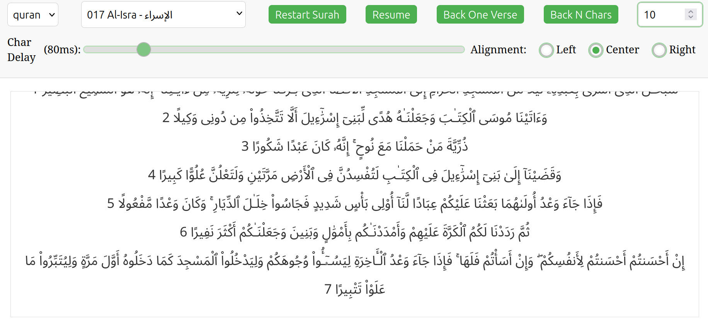

## Reciter

Reciter is a tool for memorizing Quran by allowing the reader to recite without looking at the next verses by mistake.

### Important note
The tool is not revised yet, however the content was fetched directly from [quran.com](https://quran.com)

